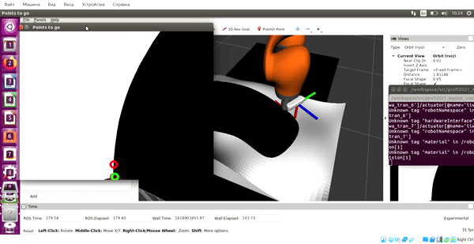

The provided software includes a ROS package containing an example of manipulator control in the moment control mode, changing controllers, reading data from a force-moment sensor and obtaining an image from a camera mounted on the manipulator in the gazebo simulator.

Working with the package is supposed to be from a docker container provided to participants as part of the [main repository of the Olympiad] (https://gitlab.com/beerlab/prof2021/profi2021_robotics) and together with [a repository with a description of the scene and manipulator for the simulator](https://gitlab.com/beerlab/prof2021/profi2021_master_scene ), accordingly, the instructions provided below require pre-executing the instructions provided in the designated repositories.

#### Installing the software

1. In the new terminal outside the docker container, go to the root directory of the main Olympiad repository and clone this repository into the working environment by doing:

        cd workspace/src
        git clone https://gitlab.com/shamraev.alexeyd/profi2021_master_solution.git

2. Open a bash session **inside the container**, go to the mounted working environment and collect all the packages:

        bash docker/into_docker.sh
        cd /workspace
        catkin build

#### Description of the software

1. The repository is a ROS package that includes Force-Motion control of Kuka Iiva manipulator.

2. Before running the example, make sure that the software from the [repository with a description of the scene and manipulator for the simulator] (https://gitlab.com/beerlab/prof2021/profi2021_master_scene) installed correctly.

    Run the simulator:

        roslaunch profi2021_master_scene start_scene.launch

    Wait until the simulator is loaded and the quadcopter appears on the stage. To run the example in a new bash session ** inside the container** run:

        roslaunch profi2021_master_solution solution.launch

    It is worth noting that by default, the laucnh file _solution.launch_ specifies an executable file compiled from the **C++** file test.cpp . To use a similar program written in **Python 2**, you need to comment out the line:

        <node pkg="profi2021_master_solution" type="master_test" name="master_test" output="screen" />

    and uncomment:

        <node pkg="profi2021_master_solution" name="master_test" type="test.py" output="screen"/>

    At the same time, in some case, the **.py** file must be given execution rights:
        
        chmod a+x src/profi2021_master_solution/scripts/test.py
    
    Upon successful completion of all the above actions, the manipulator will move the working tool along a curved surface on the border of black and white;

    

    The source code of the example is in *scripts/test.py * and *src/test.cpp * and represents the ROS node */profi2021_master_solution*. The node subscribes to [topics */iiwa/joint1_torque_controller/command, ... , /iiwa/joint7_torque_controller/command*](https://docs.ros.org/en/api/std_msgs/html/msg/Float64.html ) to control the moments on the joints, on the topic [*/iiwa/controller_manager/switch_controller*](http://docs.ros.org/en/api/controller_manager_msgs/html/srv/SwitchController.html ) to enable _torque_ controllers and on the topic [*/iiwa/joint_states*](https://docs.ros.org/en/api/sensor_msgs/html/msg/JointState.html ) to read data on the position and speed of joints.
