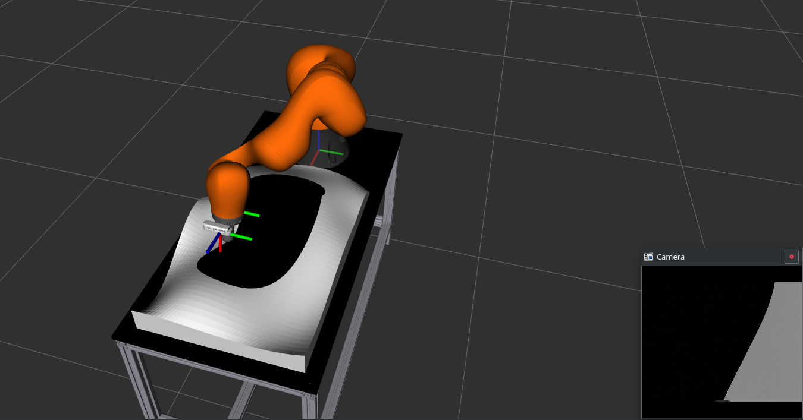
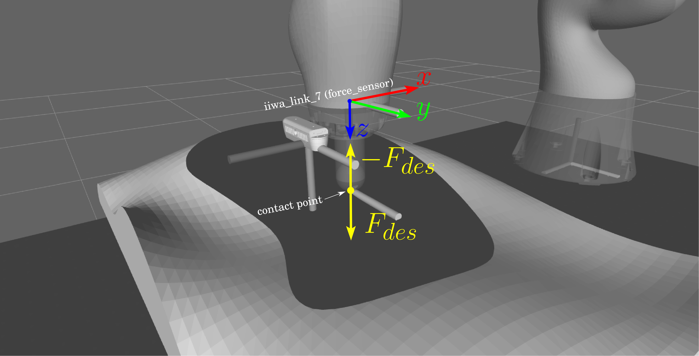

Репозиторий содержит программное обеспечение для
подготовки и сдачи задания категории _Магистратура_  направления Робототехники олимпиады [Я - Профессионал](https://yandex.ru/profi/courses2020).

Данный репозиторий будет использоваться для проведения оценки заданий участников.

Предоставялемое программное обеспечение включает ROS-пакет, содержащий пример управления манипулятором в режиме управления моментом, смены контроллеров, чтения данных с силомоментного датчика и получения изображения с камеры, установленной на манипуляторе в симуляторе gazebo.

Работа с пакетом предполагается из docker-контейнера предоставляемого участникам в составе [основного репозитория олимпиады](https://gitlab.com/beerlab/prof2021/profi2021_robotics) и совместно с [репозиторием с описанием сцены и манипулятора для симулятора](https://gitlab.com/beerlab/prof2021/profi2021_master_scene), соответственно, предоставляемые далее инструкции требуют предварительно выполнить инструкции, представленные в обозначенных репозиториях.

#### Установка программного обеспечения

1. В новом терминале вне docker-контейнера перейдите в корневую директорию основного репозитория олимпиады и склонируйте данный репозиторий в рабочее окружение выполнив:

        cd workspace/src
        git clone https://gitlab.com/beerlab/prof2021/profi2021_master_solution.git

2. Откройте bash-сессию **внутри контейнера**, перейдите в смонтированное рабочее окружение и соберите все пакеты:

        bash docker/into_docker.sh
        cd /workspace
        catkin build

#### Описание программного обеспечения

1. Репозиторий представляет собой ROS-пакет, который участникам олимпиады предстоит использовать для представления своего решения для оценки. Пакет включает в себя пример управления манипулятором c помощью PD-регулятора с компенсацией гравитации.

2. Перед запуском примера убедитесь, что программное обеспечение из [репозитория с описанием сцены и манипулятора для симулятора](https://gitlab.com/beerlab/prof2021/profi2021_master_scene) установленно корректно.

    Запустите симулятор:

        roslaunch profi2021_master_scene start_scene.launch

    Дождитесь окончания загрузки симулятора и появления квадрокоптера на сцене. Для запуска примера в новой bash-сессии **внутри контейнера** выполните:

        roslaunch profi2021_master_solution solution.launch

    Стоит отметить, что по умолчанию в laucnh-файле _solution.launch_ указан исполняемый файл, скомпилированный с **C++** файла test.cpp. Для использования аналогичной программы, написанной на языке **Python 2** необходимо закомментировать строку:

        <node pkg="profi2021_master_solution" type="master_test" name="master_test" output="screen" />

    и раскомментировать:

        <node pkg="profi2021_master_solution" name="master_test" type="test.py" output="screen"/>

    При этом в некотором случае **.py** файлу необходимо дать права на исполнение:
        
        chmod a+x src/profi2021_master_solution/scripts/test.py
    
    При успешном выполнении всех выше обозначенных действий манипулятор переместится рабочим инструментом в стартовую точку и через 3 секунды начнет движение по окружности в плоскости _x - y_;

    

    Исходный код примера находится в *scripts/test.py* и *src/test.cpp* и представляет собой ROS-узел */profi2021_master_solution*. Узел подписывается на [топики  */iiwa/joint1_torque_controller/command, ... , /iiwa/joint7_torque_controller/command*](https://docs.ros.org/en/api/std_msgs/html/msg/Float64.html) для управления моментами на сочленениях, на топик [*/iiwa/controller_manager/switch_controller*](http://docs.ros.org/en/api/controller_manager_msgs/html/srv/SwitchController.html) для включения _torque_ контроллеров и на топик [*/iiwa/joint_states*](https://docs.ros.org/en/api/sensor_msgs/html/msg/JointState.html) для чтения данных о положении и скорости сочленений.

  3. По заданию участнику необходимо реализовать движение вдоль кривой по часовой стрелке относительно мировой системы координат, заданной границей перехода белая-черная область с поддержанием желаемой постоянной силы. Значение силы задается при запуске решения ROS параметром **_force_desired_** в слудующем виде:

          roslaunch profi2021_master_solution solution.launch force_desired:=40

  В таком же виде будет задаваться желаемая сила виртуальным судьей, то есть он запустит указанную выше команду с произвольным положительным (менее **120** Н) параметром желаемой силы. По умолчанию, если не указать ROS параметр _force_desired_, то ему присвоится значение **20**.

  **[!]** Обратите внимание, что измерения силы контакта между рабочим инструментом и поверхностью выражены в системе координат датчика силы `iiwa_link_7`, соответственно, при контакте сила вдоль оси Z может иметь отрицательные значения. Однако, желаемая сила, задаваемая для вас судьей всегда положительное вещественное число (см. III Закон Ньютона). Описанное здесь иллюстрируется на рисунке ниже.
   

